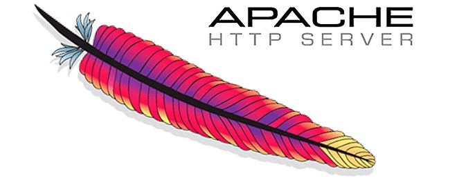

# deliverable 1

## concepts I don't understand
* apache: it is a free and open source web server platform
* ufw: the default firewall configuration tool for ubuntu
* firewall: a computers security system that monitors and controls network traffic

## What is a web server? Hardware and software side
a web server can refer to hardware or software or both of them working together. 
On the hardware side, a web server is a computer that stores web server software and a website's component files (HTML documents, images, CSS stylesheets, and JavaScript files). A web server connects to the Internet and supports physical data interchange with other devices connected to the web.
On the software side, a web server includes several parts that control how web users access hosted files. At a minimum, this is an HTTP server. An HTTP server is software that understands URLs (web addresses) and HTTP (the protocol your browser uses to view webpages). An HTTP server can be accessed through the domain names of the websites it stores, and it delivers the content of these hosted websites to the end user's device.

## What are some different web server applications?

### apache

Apache is open-source web server software that is developed and maintained by the Apache Software Foundation and is available for free.

### lighttpd

Lighttpd is high-performance web server software designed for speed, security, and flexibility. It can be an excellent option for environments with minimal resources, dynamic websites, or diverse applications. However, you might be wondering what makes it different from other solutions.

### cherokee

Cherokee is an open-source cross-platform web server that runs on Linux, BSD variants, Solaris, OS X, and Windows. It is a lightweight, high-performance web server/reverse proxy licensed under the GNU General Public License. Its goal is to be fast and fully functional yet still light. Major features of Cherokee include a graphical administration interface named cherokee-admin, and a modular light-weight design. 

## What is virtualization?
 Virtualization enables the hardware resources of a single computer—processors, memory, storage and more—to be divided into multiple virtual computers, called virtual machines (VMs).

## What is virtualbox?
VirtualBox is a tool for virtualizing x86 and AMD64/Intel64 computing architecture, enabling users to deploy desktops, servers, and operating systems as virtual machines. You can use this solution to deploy as many virtual machines as the host architecture has the resources for.

## What is a virtual machine?
A virtual machine is an emulated environment running on a machine with its CPU, memory, and storage. With the help of a virtual machine, we can run additional operating systems on top of the current operating system there are 2 types of virtual machines
  * System virtual machine: It is used to emulate the entire operating system, which simulates an entire physical computer, such as running a Ubuntu operating system in a virtual machine.
  * Process virtual machine: It emulates a process independent of the host environment. This means we run a single application in the virtual environment instead of a whole operating system.

## What is Ubuntu Server?
 Ubuntu Server is a part of the larger set of Ubuntu products and operating system developed by Canonical Ltd. Ubuntu server is a specific addition that differs a little bit from Ubuntu desktop, in order to facilitate installation on servers. Ubuntu tools, which are open-source software, are alternatives to various types of licensed products. The word "Ubuntu" comes from a South African term for togetherness and sharing.

## What is a firewall?
a firewall is a network security device that monitors and filters incoming and outgoing network traffic based on an organization's previously established security policies.

## What is SSH?
SSH, also known as Secure Shell or Secure Socket Shell, is a network protocol that gives users, particularly system administrators, a secure way to access a computer over an unsecured network. SSH also refers to the suite of utilities that implement the SSH protocol. Secure Shell provides strong password authentication and public key authentication, as well as encrypted data communications between two computers connecting over an open network, such as the internet.

