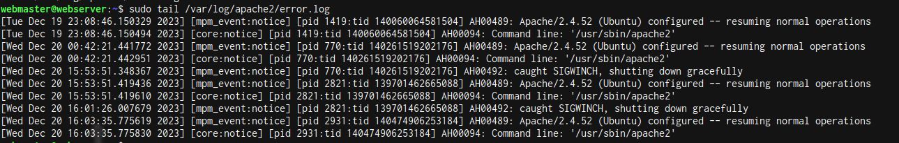

# deliverable 2

##  What are the server hardware specifications (virtual machine settings)?
 

## What is Ubuntu server log in screen?
 

##  What is the IP address of your Ubuntu Server Virtual Machine?
 

## How do you enable the Ubuntu Firewall?
 
## How do you check if the Ubuntu Firewall is running?
 
## How do you disable the Ubuntu Firewall?
 
## How do you add Apache to the Firewall?
 
## What is the command you used to install Apache?
 

## What is the command you use to check if Apache is running?
 

## What is the command you use to stop Apache?
 

## What is the command you use to restart Apache?
 

## What is the command used to test Apache configuration?
 

## What is the command used to check the installed version of Apache? 

## What are the most common commands to troubleshoot Apache errors? Provide a brief description of each command.
  * `systemctl`: used to control and interact with linux services via the `systemd` service manager
  * `journalctl`: used to query and view the logs that are generated by `systemd`
  * `apachectl`:when troubleshooting this command is used to check apaches configuration

## Which are Apache Log Files, and what are they used for? Provide examples and screenshots.
apache log files are a very helpful resource used in troubleshooting, generally any error that you receive in a browser or any other HTTP client will have a corresponding entry in apaches logs
 