# Introduction
This is a project that i am doing, I am creating a simple website based on the sport I practice. This website is to test my knowledge and skills i have acquired throughout this course.

# Basic terminology the reader must know

## Virtualbox
 
VirtualBox is a powerful x86 and AMD64/Intel64 virtualization product for enterprise as well as home use. Not only is VirtualBox an extremely feature rich, high performance product for enterprise customers, it is also the only professional solution that is freely available as Open Source Software under the terms of the GNU General Public License (GPL).

## Ubuntu
 
Ubuntu is a Linux distribution based on Debian and composed mostly of free and open-source software. Ubuntu is officially released in multiple editions: Desktop, Server, and Core for Internet of things devices and robots. The operating system is developed by the British company Canonical. 

## Apache
 
the Apache HTTP Server Project is an effort to develop and maintain an open-source HTTP server for modern operating systems including UNIX and Windows. The goal of this project is to provide a secure, efficient and extensible server that provides HTTP services in sync with the current HTTP standards.

## SSH
 
SSH, also known as Secure Shell or Secure Socket Shell, is a network protocol that gives users, particularly system administrators, a secure way to access a computer over an unsecured network.

## Firewall
 
A firewall is a network security device that monitors incoming and outgoing network traffic and decides whether to allow or block specific traffic based on a defined set of security rules.

# Step-by-Step Instructions

# 1st Part Virtual Machine
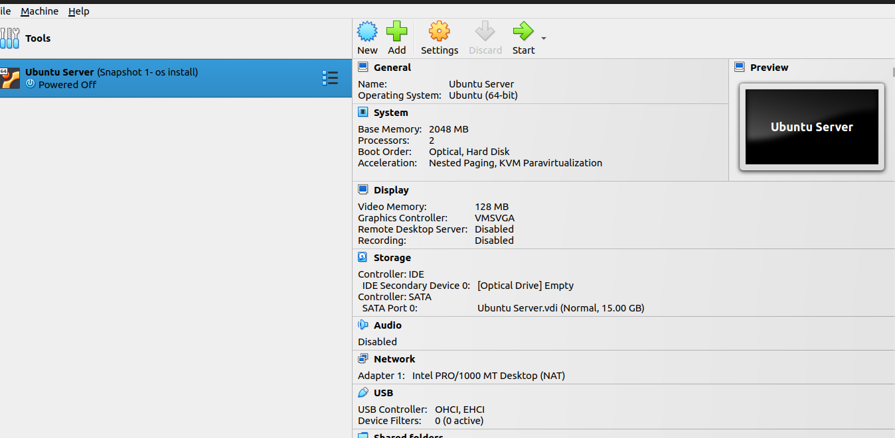 

The recommended system requirements are:

* CPU: 1 gigahertz or better
* RAM: 1 gigabyte or more
* Disk: a minimum of 2.5 gigabytes

# 2nd Part Install Ubuntu Server
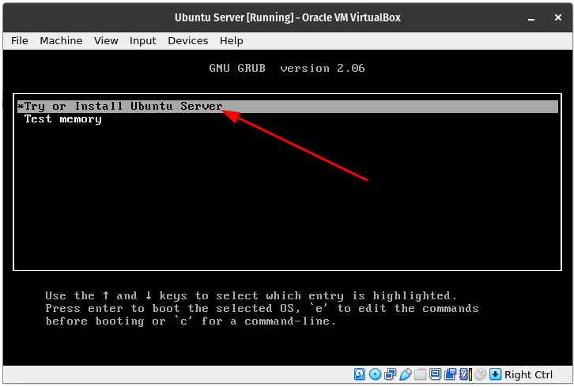 
to begin installing the ubuntu server you first go to the ubuntu website and download the installer package
a window will appear like the screenshot above and you choose to try or install the ubuntu server.
you will then be prompted to choose your language and then update the ubuntu server.
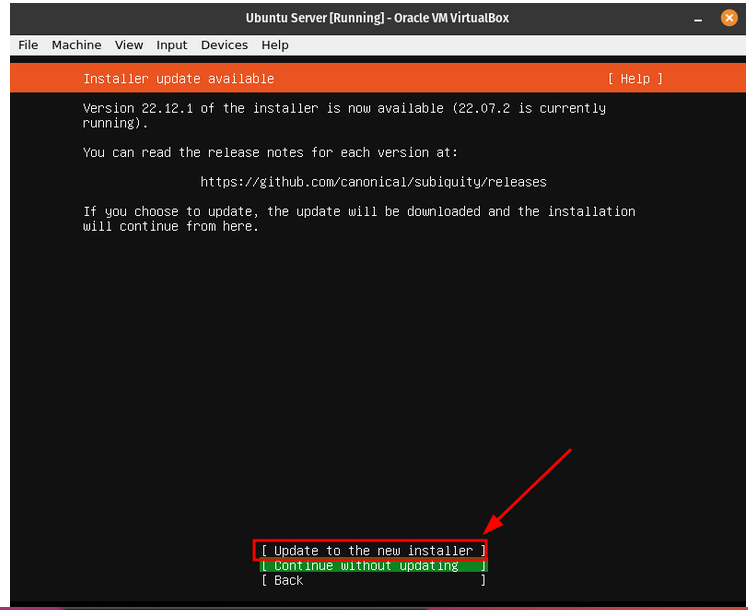 
after this the installer will detect your keyboard you enter ok and proceed to choose what type of installation you want in this case i chose the default ubuntu server installation.
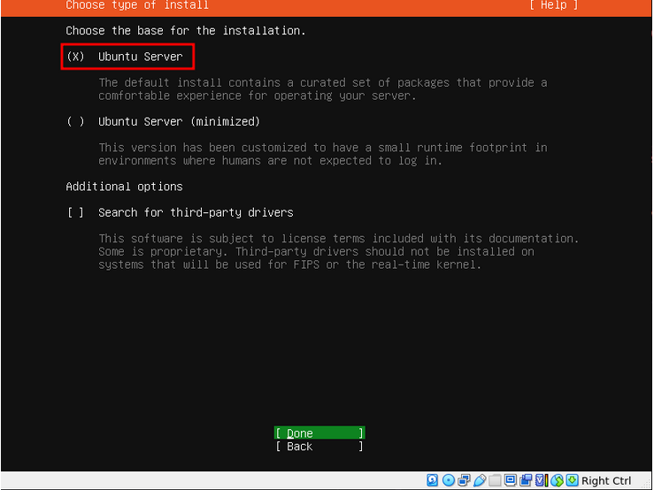 
next you will see a screen that will show you you're servers ip address and after that screen it will ask you for a proxy address you will leave that blank, the following screen will show you the mirror address you will also leave that the same.
next you will format the entire disk and after that you will see a screen that lets you know the changes that will be made to your servers virtual hard drive. next you will enter you're computers information and this information should be stored somewhere as you will need it.
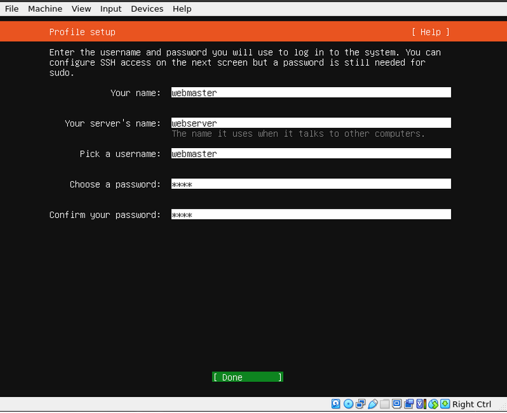 
next is to install ssh do not import the keys as that will be done later
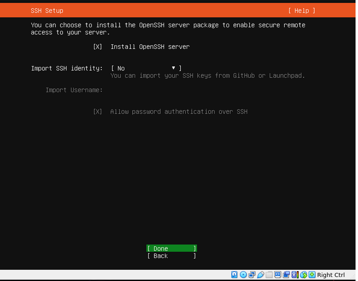 
you will be shown many services after this you do not need to select any of them. the following screen will show the installation process and will then ask to reboot. Once you reach the end all you have to do is press enter as shown below.
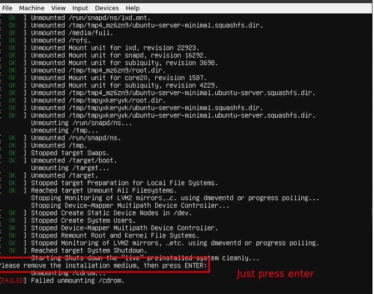 

# 3rd part Install Apache
now we will install apache to begin you will enter your username and password into the server.
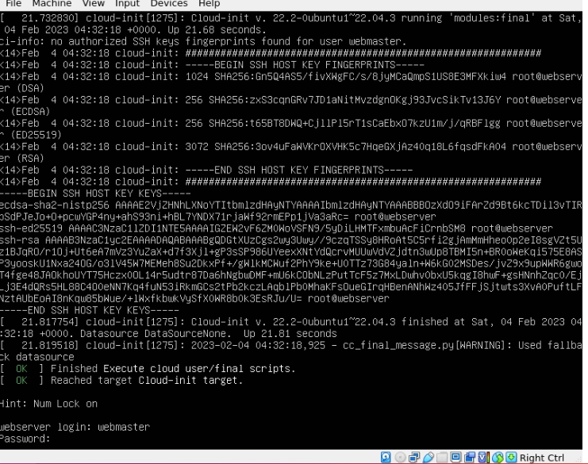 
the next step is to update the system by entering the following commands `sudo apt update; sudo apt upgrade -y`
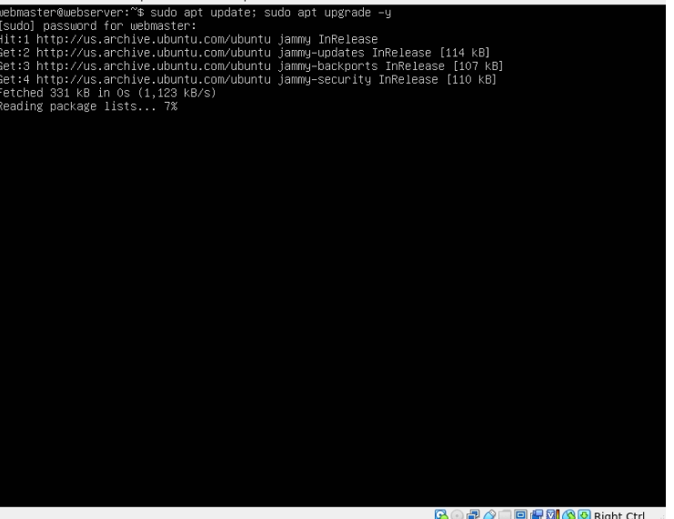 
now that everything is updated we can now install apache by entering the following command in the terminal
`sudo apt install apache2 -y`
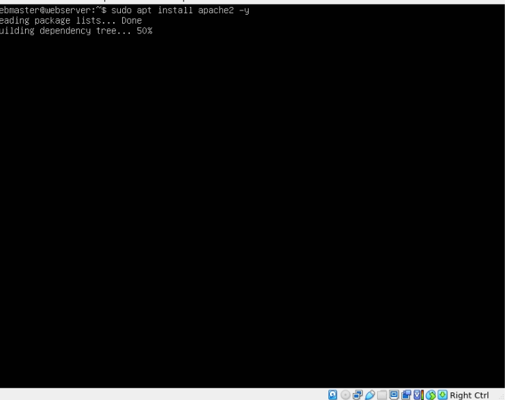 
after everything is done you might need to restart some services.

# 4th part Set up SSH
next we will set up SSH but before that the firewall must be activated by entering the following command
`sudo ufw enable` then we will configure ufw to allow apache and ssh traffic with the following commands `sudo ufw allow 'Apache` `sudo ufw allow 'OpenSSH` after this you will check the status of the firewall with the following command `sudo ufw status` 
the screen should look like this
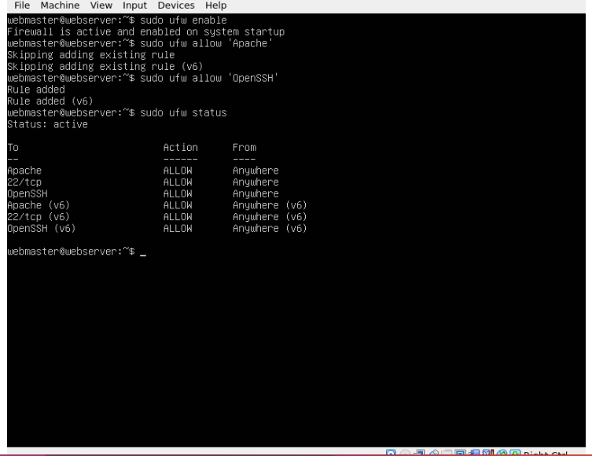 
next we will check on the status of apache and ssh with the following command `systemctl status apache2 --no-pager` `systemctl status ssh --no-pager`
the prompt should return saying running and if they don't enter the following command `sudo systemctl restart apache2 ssh`
it will look like so
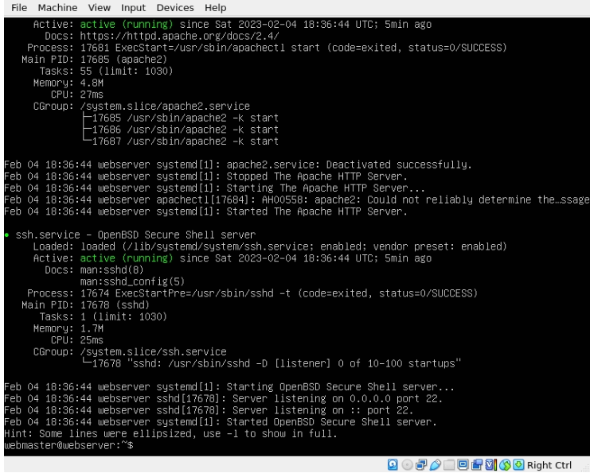 
you will now shut dow the virtual machine with this command `sudo shutdown now` we will now use port forwarding to get an ip address for our virtual machine as shown in the screenshot below
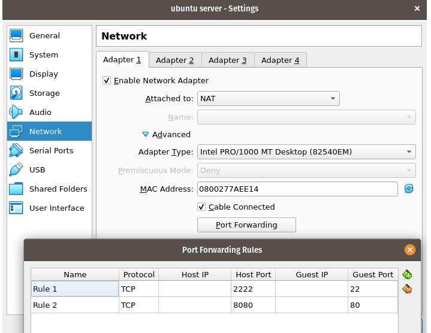 
now we will make sure that ssh is installed in both the client and the server by entering the following command ` sudo apt install openssh -y` in the server the ssh must already be running if it is not enter the following command `sudo systemctl enable ssh; sudo systemctl start ssh` next you will need to get the ip address of the server by entering this command `ssh -p 2222 username@127.0.0.1` and you will be done with this part

# 4th part set  up virtual hosts
now we will create the directory for mywebsite as follows: `sudo mkdir /var/www/mywebsite`
Next we will modify the ownership of `mywebsite` so that it is now owned by your user instead of root `sudo chown -R $USER:$USER /var/www/mywebsite`
Now let’s change the file permission so that the owner can read, write, and execute the files while granting only read and execute permissions to groups and others: `sudo chmod -R 755 /var/www/mywebsite`
Now lets create a simple html document to be served from our new virtual host. Next we will create a document with the nano text editor called `index.html` in the `/var/www/mywebsite/ directory`:
`sudo nano /var/www/mywebsite/index.html`.
when the new document opens you will type the following text 
<html>
    <head>
        <title>My First Website</title>
    </head>
    <body>
        <h1>This is a sample document!</h1>
    </body>
</html>
after this is done save and close the file.
Now we need to create a virtual host file so that this new content can be served. The default configuration is located in /etc/apache2/sites-available/000-default.conf we do not need to touch this file, we can just create a new one. To create a new config file, we are going to use nano again: 

`sudo nano /etc/apache2/sites-available/mywebsite.conf`
after this is created you will type the following text in the domain config file:
<VirtualHost *:80>
    ServerAdmin webmaster@localhost
    ServerName mywebsite
    ServerAlias www.mywebsite
    DocumentRoot /var/www/mywebsite
    ErrorLog ${APACHE_LOG_DIR}/error.log
    CustomLog ${APACHE_LOG_DIR}/access.log combined
</VirtualHost>
you will then save and close the file
Now enable the site with the following command: `sudo a2ensite mywebsite.conf`
Now lets disable the default domain: `sudo a2dissite 000-default.conf`
Before we can refresh the configuration, we need to add a configuration line to the apache2.conf file. Open the file in nano: `sudo nano /etc/apache2/apache2.conf`
Add the following line at the end of the file: `ServerName 127.0.0.1`
Save and close the file when you are finished
Now you can test the configuration for errors:
`sudo apache2ctl configtest`
The output of the command should look like this:

`Syntax OK`
if no error were found enter the following command `sudo systemctl restart apache2`
now to check your document you open a web browser and type this command `http://ip.address.of.your.server/` and your index.html document should load. 
