hi professor just reminding you about the situation i am in 
---
Name: Yadir Ibarguen
Course: cis106
Semester: fall 23
---

# Lab 4 The Linux File System

## Question  1
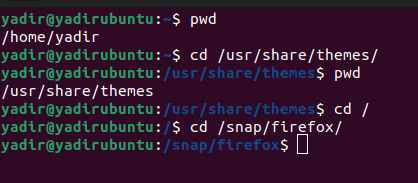 
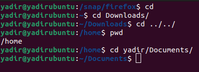 

## Question 2
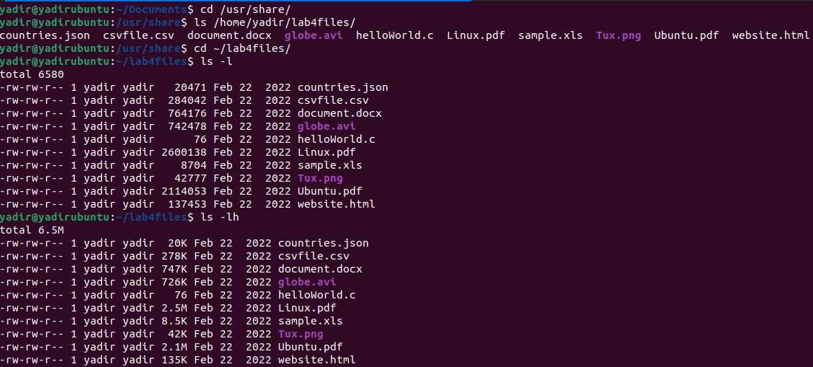 
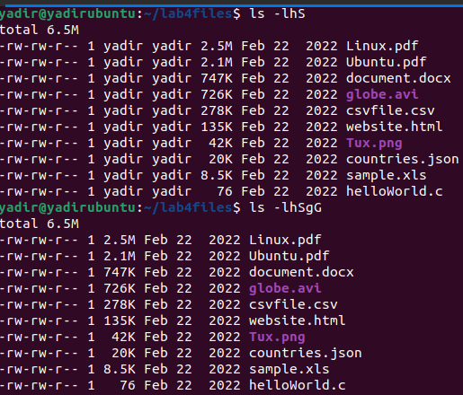 
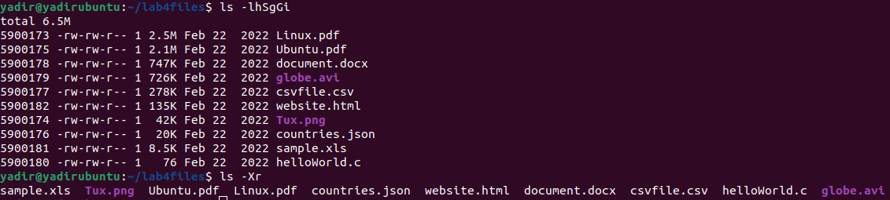 

## Question 4
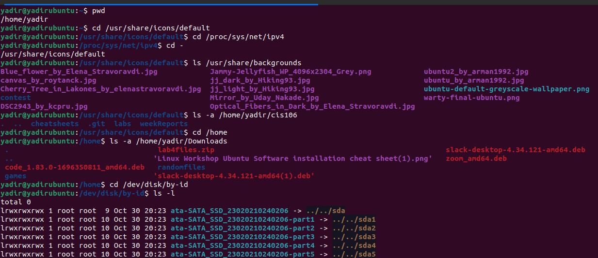 
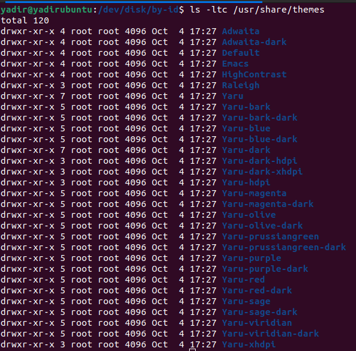 
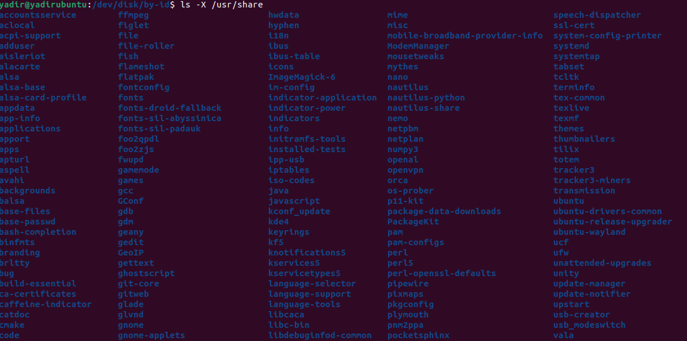 
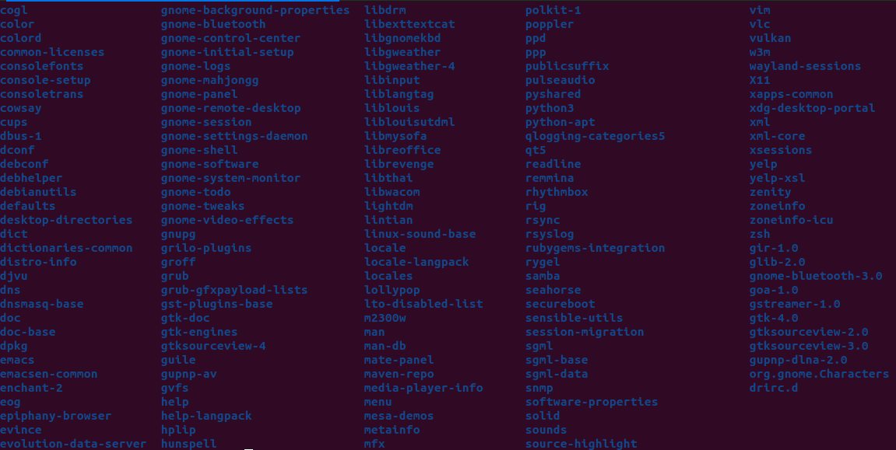 

## Question 5
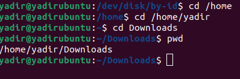 
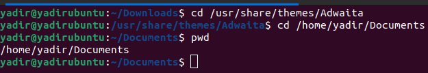 