You told me to remind you about my current homelessness situation for my reason for handing this in late i apologize again professor
---
Name: Yadir Ibarguen
Semester: Fall 23
Course: Cis 106
---
# lab 7

## question 1
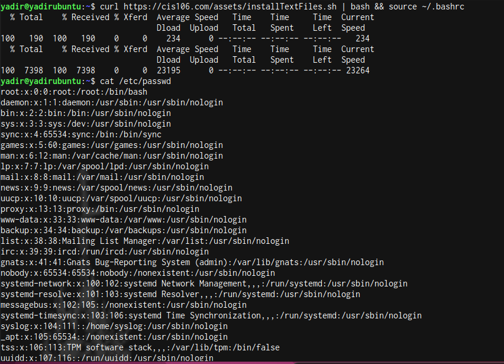 
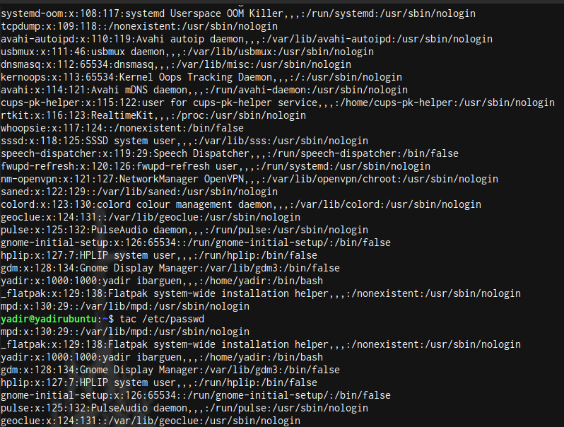 
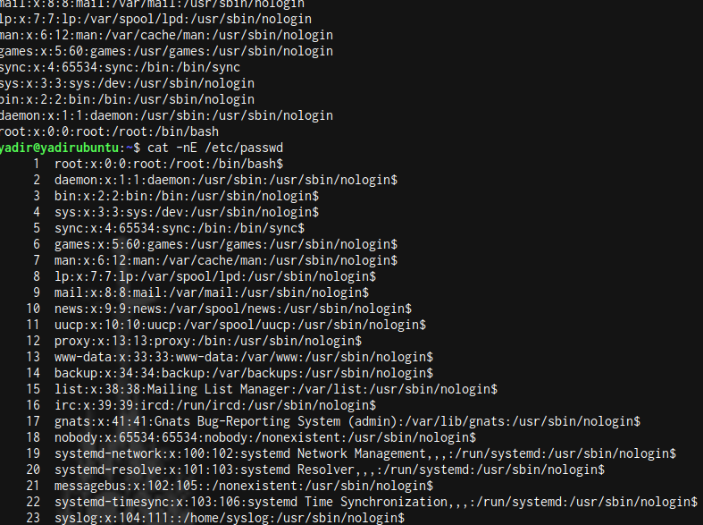 
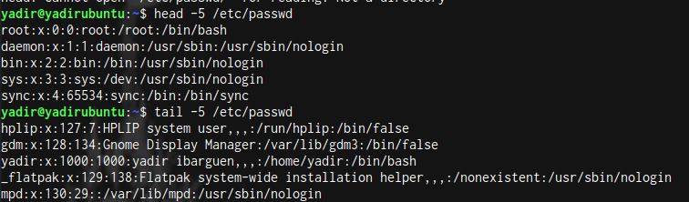 

## question 2
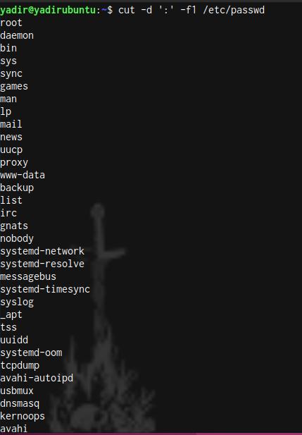 
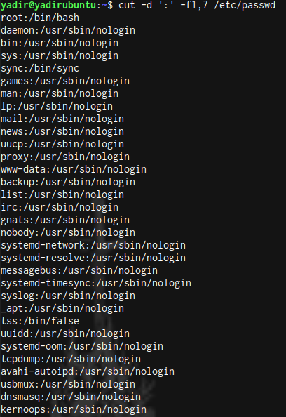 
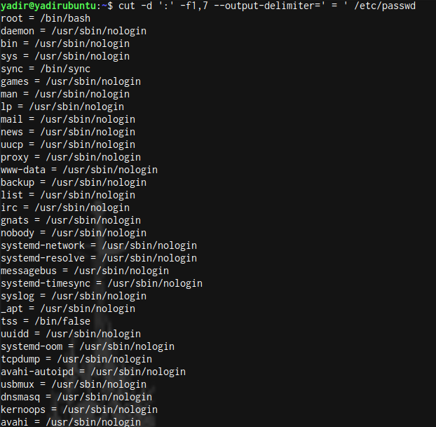 

## question 3
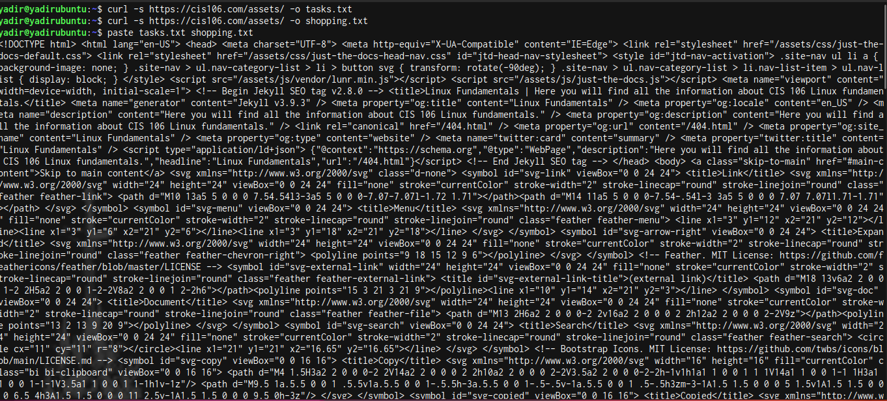 
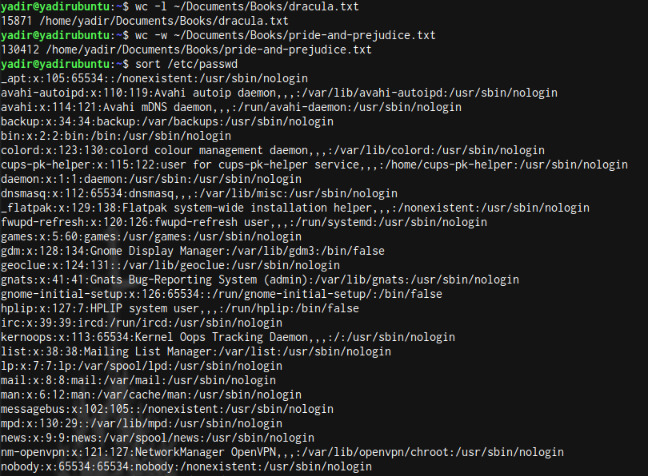 

## question 4
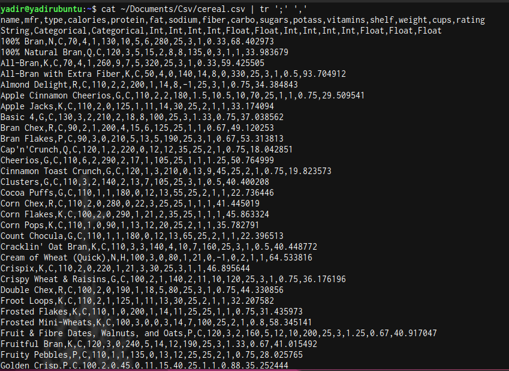 
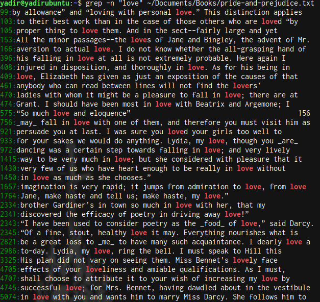 
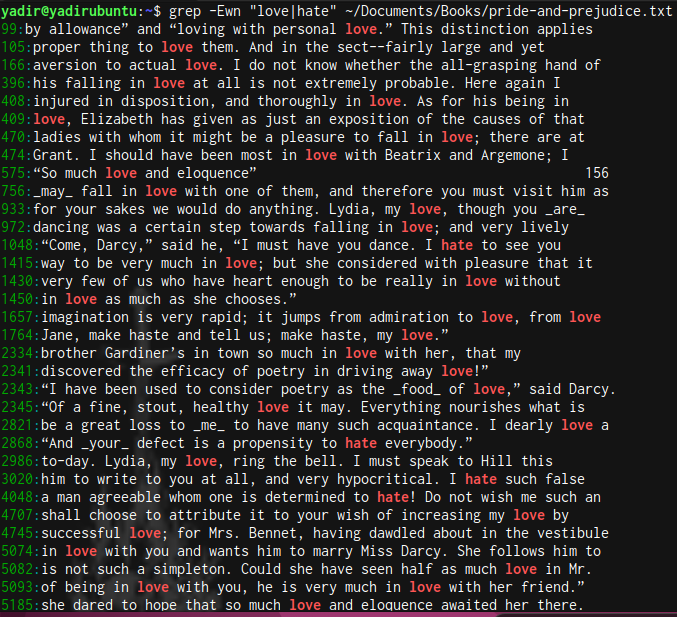 
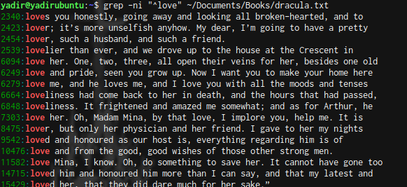 
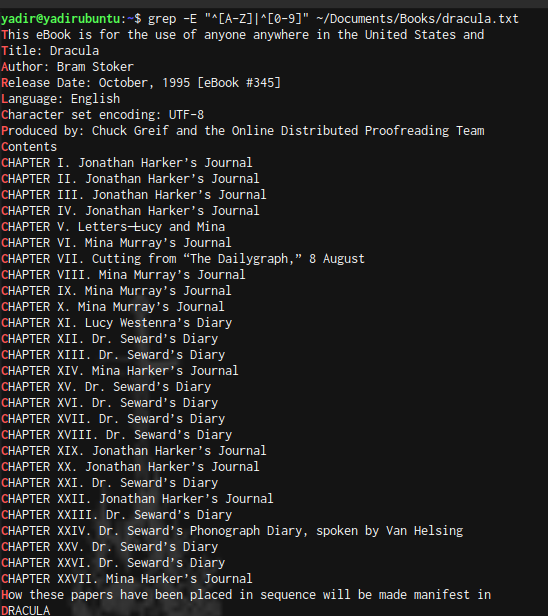 

## question 5
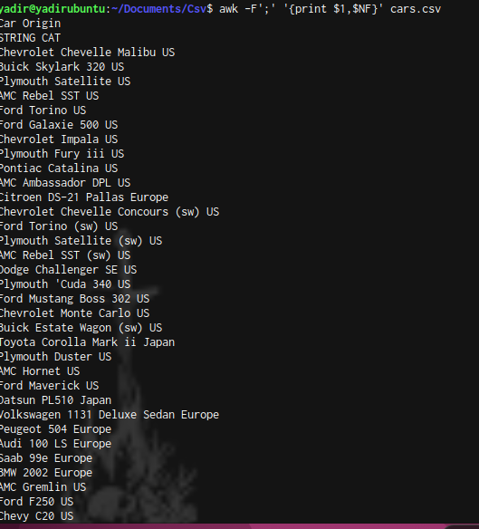 
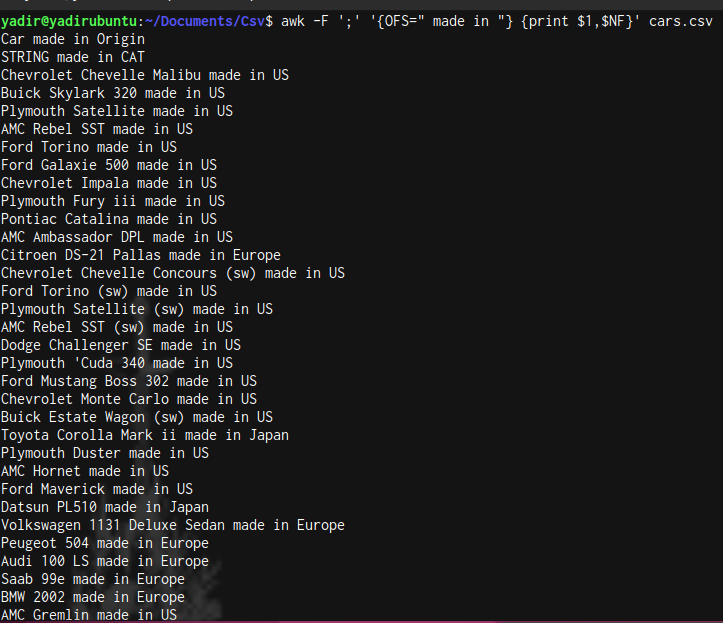 
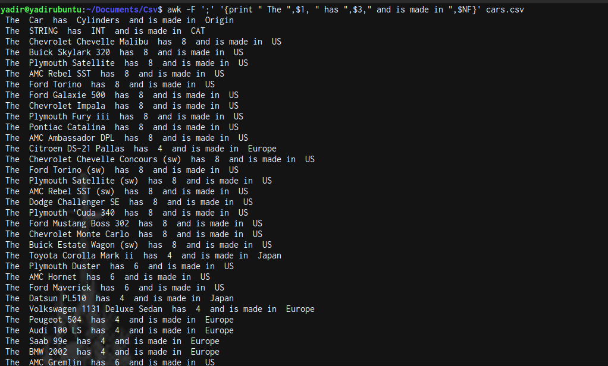 
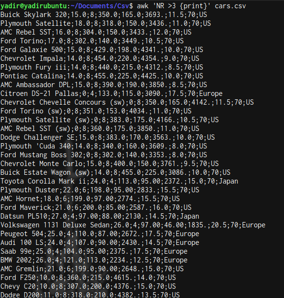 
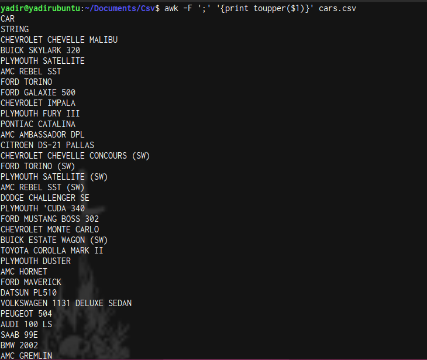 
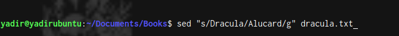 
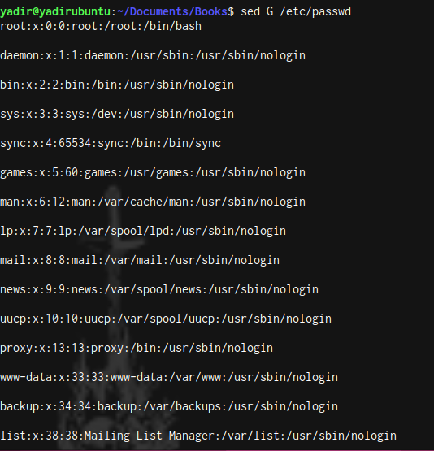 
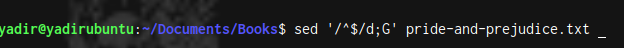 

## question 6
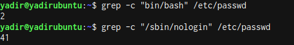 
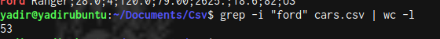 
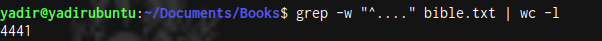 

## challenge question
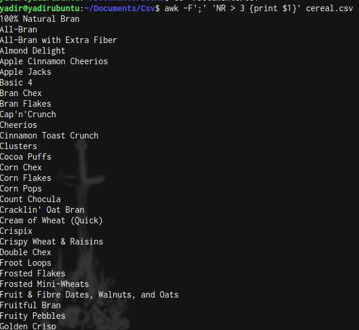 
 
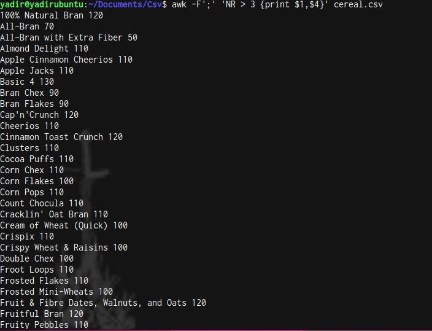 
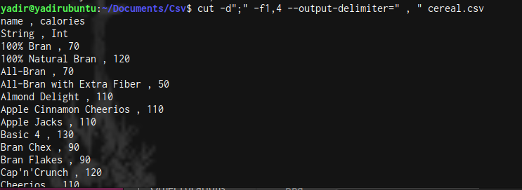 