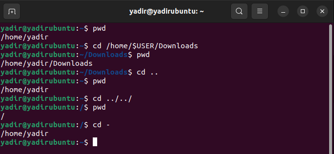
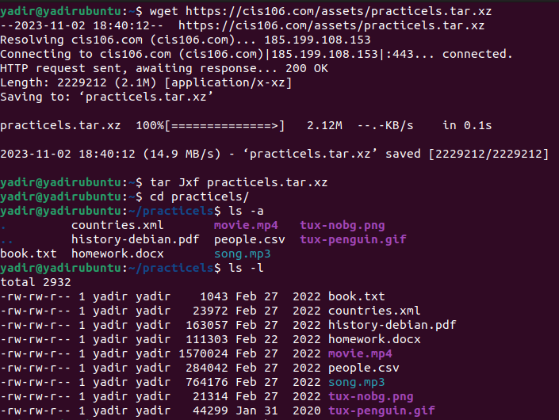
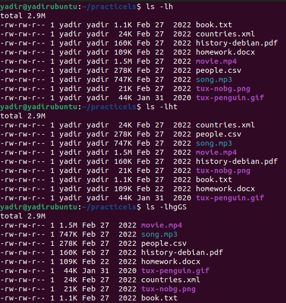
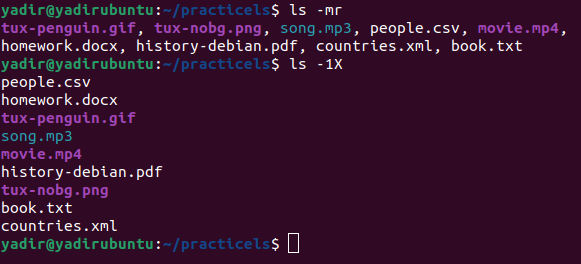
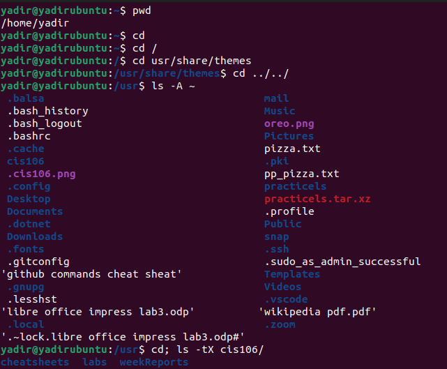
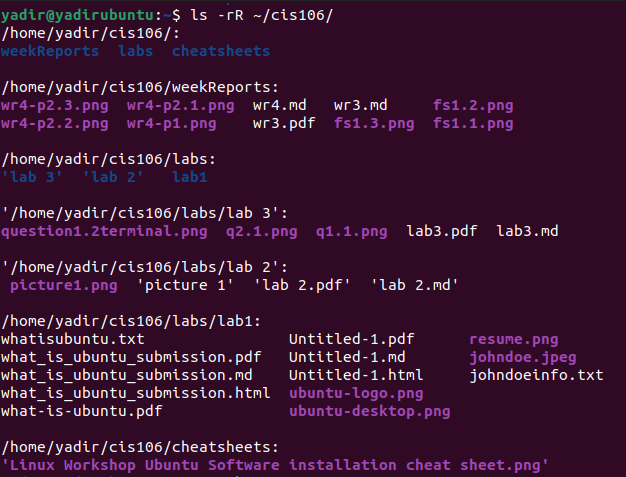
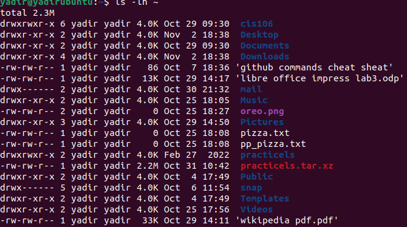
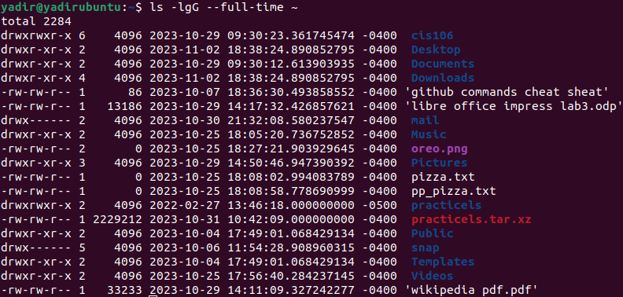

just reminding you about the situation i am in professor thank you
---
Name: Yadir Ibarguen
Course: cis106
Semester: fall 23
---

# week report 4

## Complete all the Practice in the presentation “The Linux File System”
### practice 1
 

### practice 2
 
 
 

### practice 3
 
 
 
 

## The Linux File system directories and their purpose:
 
  
 

## All the commands for navigating the filesystem:
| Command | What it Does               | Syntax           | Example      |
| ------- | -------------------------- | ---------------- | ------------ |
| pwd     | displays current directory | pwd              | `pwd`        |
| cd      | changes current directory  | cd + destination | `cd Documents` |
| ls | lists the content of current directory| ls + option + directory to list | `ls -a` |
## Basic Terminology

* **File system**
the way files are stored and organized
* **Current directory**
the directory you are in at the moment  

* **parent directory**
the primary or top-level folder in a chain of subfolders.

* **the difference between your home directory and the home directory**
your home directory is the current directory you are working in either in the terminal emulator or in the file manager. the home directory is only accessible as the root user or also known as the administrator.
  
* **pathname**
every file has a path name which indicates the location of the file in the file system
* **relative path**
the location of a file starting from the current working directory or a directory that is located inside the current working directory. for example Downloads/song.mp3
* **absolute path**
the location of a file starting at the root of the file system for example /home/john/Downloads/song.mp3