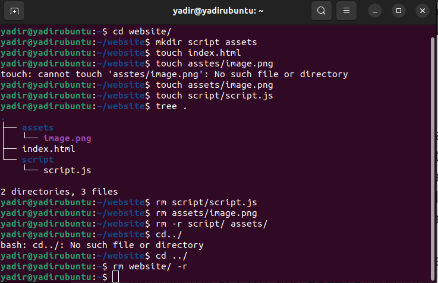
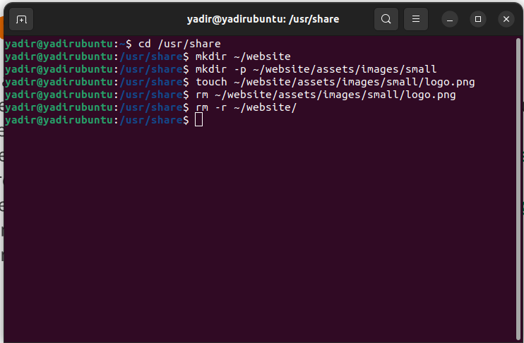
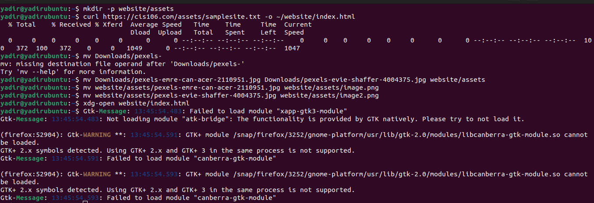
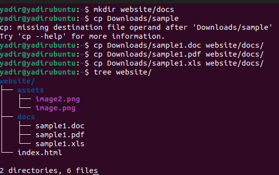

You told me to remind you about my current homelessness situation for my reason for handing this in late i apologize again professor
---
Name: Yadir Ibarguen
Semester: Fall 23
Course: Cis 106
---

# Week Report 5

## Answer to questions

* **What are Command Options?**
command options modify or enhance the behavior of the command

* **What are Command Arguments?**
command arguments are the item which the command acts upon which can be a file or directory
* **Which command is used for creating directories? Provide at least 3 examples.**
* the command is mkdir
* example 1:
  * create a directory: `mkdir salchipapa` 
* example 2
  * create multiple directories: `mkdir movies ~/Downloads/games ~/Documents/hmw`
* example 3 
* **What does the touch command do? Provide at least 3 examples.**
* touch command is used to create files
* example 1:
  * to create a file called list `touch list`
* example 2:
  * to create several files `touch list_of_cars.txt script.py names.csv`
* example 3:
  * to create a file using absolute path `touch ~/Downloads/games.txt`

* 
* **How do you remove a file? Provide an example.**
* rm command is used to delete files 
* example 1:
  * `rm list`
 
* **How do you remove a directory and can you remove non-empty directories in Linux? Provide an example**
linux by default cannot remove non empty directories to remove an empty directory you must use the `rmdir` command and if you want to remove non empty directories you must use the `rm -r` command
* **Explain the mv and cp command. Provide at least 2 examples of each**
the mv command is the move and the rename command.
* example 1:
  * `mv Downloads/homework.pdf Documents/`
* example 2:
  *`mv games/ wallpapers/ rockmusic/ /media/student/flashdrive/`
 the cp command is used to copy files/ directories from a source to a destination
* example 1:
  * `cp Downloads/wallpapers.zip Pictures/` 
* example 2:
  * `cp Downloads/wallpapers/* ~/Pictures/ ` 

## Practice 1
 
## Practice 2
 
## Practice 3
 
## Practice 4
 